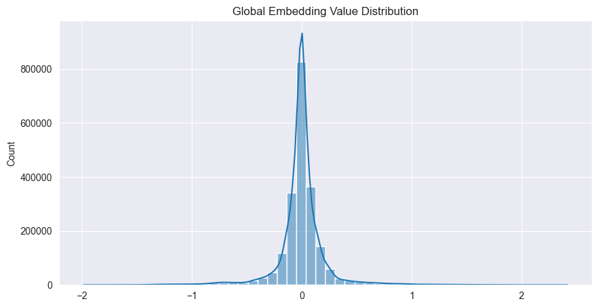

# ai-projects-ai-vros
<ol>
  <li>
    <h2>Definirea Problemei</h2>
    

      In cadrul executiei aplicatiei, se ofera un fisier audio. 
      Cerinta noastra este returnarea unei fise medicale completate in mod corect.
    

    

      Am identificat doua mari subtask-uri in dezvoltarea aplicatiei noastre: procesarea
      din fisier audio la text propriu-zis, si de la text propriu-zis la fisa medicala.
    

    

      Pentru partea de trecere de la text propriu-zis la fisa medicala nu avem nevoie de AI,
      deoarece se poate parsa in mod obisnuit. Totusi, cand vine vorba de trecerea de la fisier
      audio la text, nu avem un algoritm prin care sa extragem textul, de aceea suntem nevoiti
      sa dezvoltam un model adecvat pentru aceasta cerinta.
    

  </li>
  <li>
    <h2>Analiza datelor de intrare</h2>
    

      In cadrul dezvoltarii aplicatiei, am decis sa utilizam pentru antrenare setul de date
      de la LibriSpeech, date care vin original in format .flac, ulterior convertite in .wav.
      De asemenea, contine si fisierele text corespunzatoare rezultatelor conversiei, in format
      .txt.
    

    

      Setul de date de la LibriSpeech are ~300MB ca dimensiune (cel mai mic). In total sunt 2700 de
      fisiere audio de tip .wav, acestea au fost procesate in embedding-uri folosind wave2vec.
      In urma analizei pe date, am conclus ca datele urmeaza distributia normala.
    

    
  </li>
  <li>
    <h2>Dezvoltare aplicatie software</h2>
    

      Aplicatie python, folosind framework tkinter pentru interfata grafica, permite utilizatorului
      sa incare fisierul audio de pe masina personala, si generarea fisei medicale
    

      
  </li>
  <li>
    <h2>Dezvoltarea modelului</h2>
    

      Nu a fost nevoie de antrenare suplimentara, modelul este eficient pentru cerintele noastre
      In urma folosiri modelului pre-antrenat whisper, a trebuit sa rafinam rezultatele in formatul
      cerut: fisa medicala, folosind limbajul LaTeX.
    

  </li>
  <li>
    <h2>Propuneri de imbunatatiri</h2>
    

      Termenii medicali de specialitate sunt rar utilizati in limbajul uzual zilnic, asadar este
      posibil ca modelul pre-antrenat sa aiba un bias fata de acestea si sa le detecteze mai
      greu. Prin urmare, antrenare pe un corpus de inregistrari in care domina termenii de
      specialitate (alte inregistrari cu consulturi, cursuri de la facultati de medicina, s.a.)
    

  </li>
</ol>

